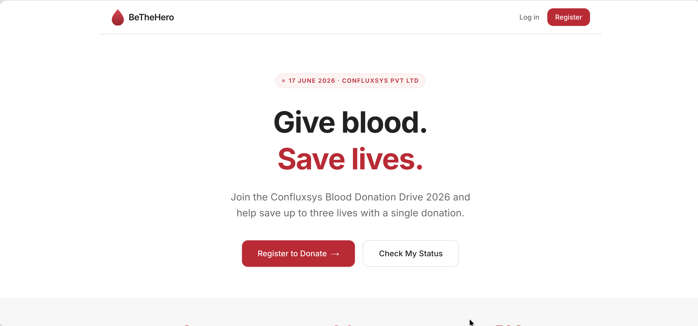
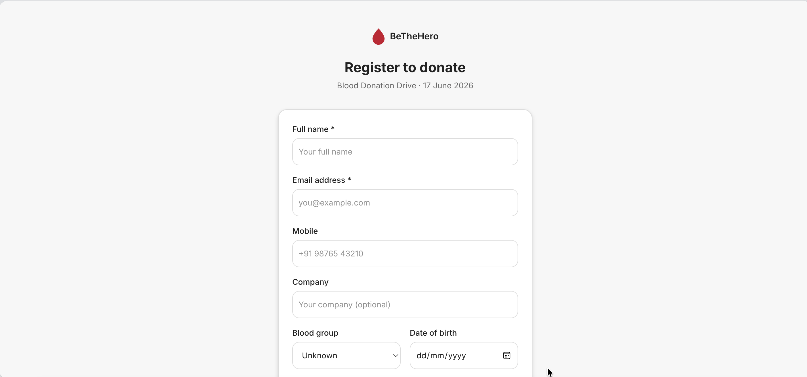
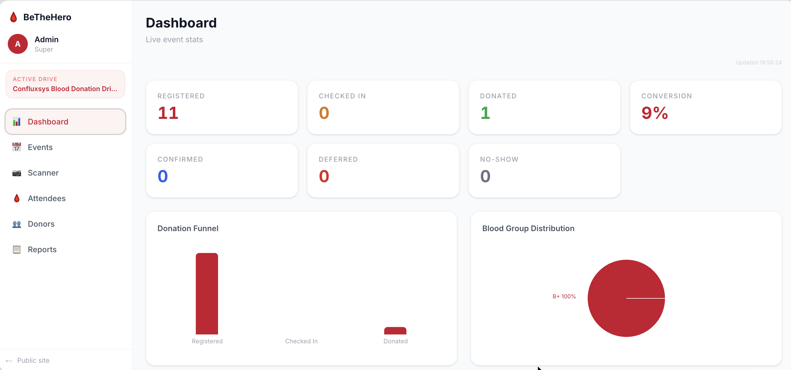

# BeTheHero

A blood donation drive management platform built for Confluxsys. Handles donor registration, event management, QR-based check-in, certificates, and admin reporting.

---

## Screenshots

| Landing Page | Registration | Admin Panel |
|---|---|---|
|  |  |  |

---

## Tech Stack

- **Framework** — Next.js 15 (App Router)
- **Database** — Supabase Postgres via Drizzle ORM
- **Auth** — Supabase Auth (OTP / magic link)
- **Email** — Resend
- **Push notifications** — OneSignal
- **Deployment** — Vercel

---

## Local Development

### Prerequisites

- Node.js 18+
- pnpm
- A Supabase project

### Setup

```bash
# Install dependencies
pnpm install

# Copy env template and fill in values
cp .env.local.example .env

# Generate and apply DB migrations
pnpm db:generate
pnpm db:migrate

# Seed initial data (optional)
pnpm db:seed

# Start dev server
pnpm dev
```

App runs at [http://localhost:3002](http://localhost:3002).

### Environment Variables

| Variable | Description |
|---|---|
| `DATABASE_URL` | Supabase pooled connection string |
| `DIRECT_URL` | Supabase direct connection (for migrations) |
| `NEXT_PUBLIC_SUPABASE_URL` | Supabase project URL |
| `NEXT_PUBLIC_SUPABASE_ANON_KEY` | Supabase anon key |
| `SUPABASE_SERVICE_ROLE_KEY` | Supabase service role key (admin operations) |
| `RESEND_API_KEY` | Resend API key for transactional email |
| `RESEND_FROM_EMAIL` | Verified sender address (e.g. `noreply@yourdomain.com`) |
| `NEXT_PUBLIC_ONESIGNAL_APP_ID` | OneSignal app ID for push notifications |
| `ONESIGNAL_REST_API_KEY` | OneSignal REST API key |
| `NEXT_PUBLIC_APP_URL` | Base URL of the app (e.g. `https://bethehero.vercel.app`) |
| `ADMIN_ALLOWLIST` | Comma-separated emails allowed to log in as admin |
| `CRON_SECRET` | Secret for securing cron job endpoints |

---

## Deployment

### Vercel (recommended)

1. Push to GitHub
2. Import the repo in [Vercel](https://vercel.com)
3. Add all environment variables from the table above
4. Deploy — Vercel auto-detects Next.js

### Database Migrations on Deploy

Migrations are not run automatically on deploy. After schema changes, run:

```bash
# Generates SQL file in /drizzle
pnpm db:generate

# Apply via Supabase SQL Editor (paste the generated .sql file)
# or run locally with DIRECT_URL set:
pnpm db:migrate
```

---

## Admin Access

1. Add the admin's email to `ADMIN_ALLOWLIST` in environment variables
2. Visit `/admin/login` and sign in with OTP
3. First-time admins are auto-provisioned on login
